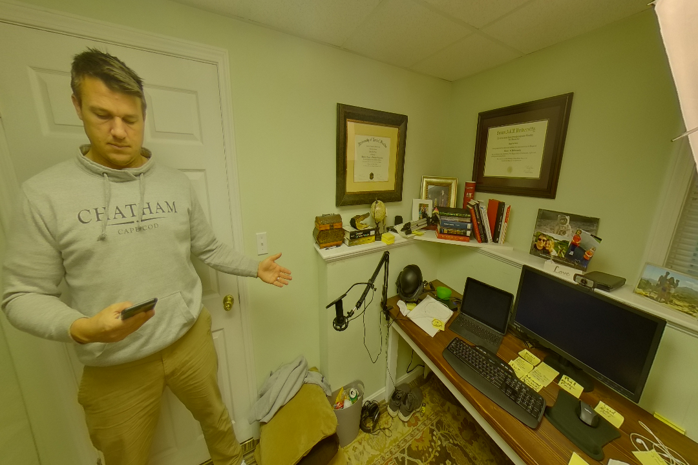

# Equirec2Perspec

# **1 Equirectangular to perspective correction**

This scrip allows to correct equirectangular frames to be converted into regular perspective images without distrortion. This will allow pre-trained deep learning models to apply inference on coverted 360 images.

## **1.1 Reference**

The code was submitted to github by [Fuen Wang](https://github.com/fuenwang/Equirec2Perspec/commits?author=fuenwang)

The code is downloaded from Githum [here](https://github.com/fuenwang/Equirec2Perspec)

## **1.2 How the code works**

### **1.2.1 How the code works**
This is a two-step process, In the first step, an equirectangular frame is loaded. In the second step the conversion happens so that

### **1.2.2 Load equirectangular image**
`equ = E2P.Equirectangular('src/image.jpg')` 

### **1.2.3 Specify parameters(FOV, theta, phi, height, width)**   
`img = equ.GetPerspective(FOV, theta, phi, height, width)`

In this last step, 

* **FOV** is the field of view in degrees. For instance, a full frame (360-degree) equirectangular image can be split up in four directions of 90 degrees each.

* **Theta** is the Z-axis (horizontal) angle (right positive, left negative)

* **Phi** is the vertical angle (up/down, (up direction positive, down direction negative)

* **The height** and width is output image dimension 

# 2 Example

Start by importing the dependacies

```python
import os
import cv2 
import Equirec2Perspec as E2P 

print('done')
```

Load a sample image


## 2.1 Load the image

```python
# Load this image
equ = E2P.Equirectangular('src/test1.JPG') 

print('done loading the image')
```

## 2.2 Convert the image

```python
# Convert the image
img = equ.GetPerspective(120, 150, -15, 720, 1080)

print('done converting the image')
```

## 2.3 Store the image

```python
# DStoring the image
cv2.imwrite('output.png',img)
```


